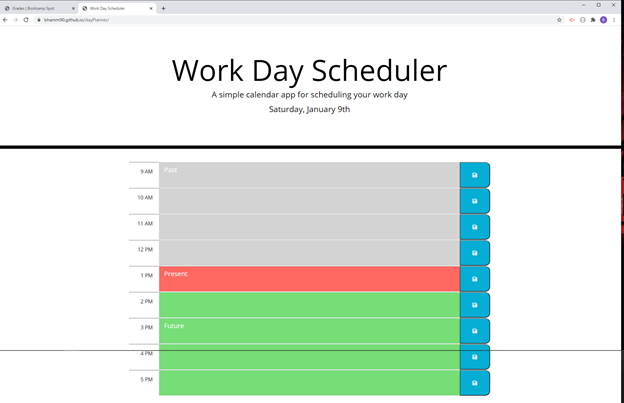
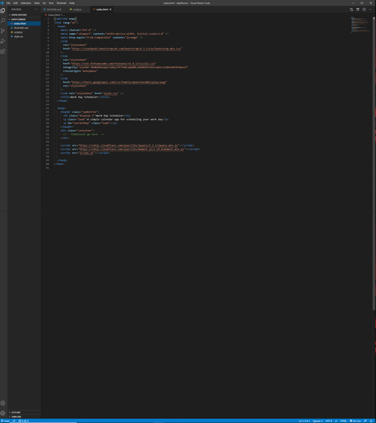
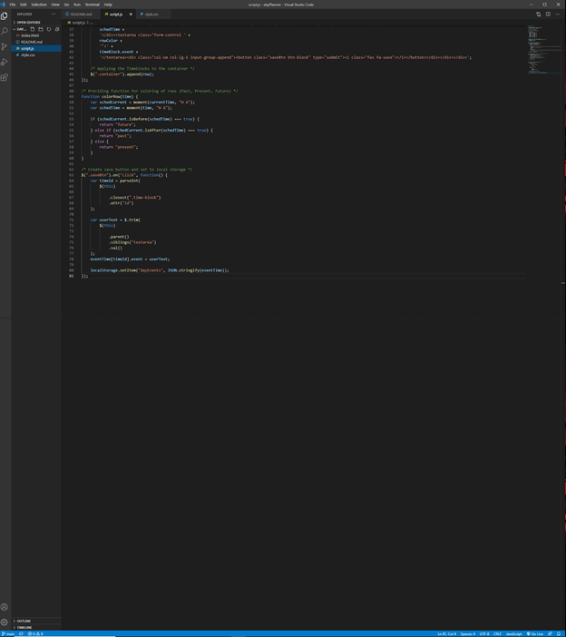
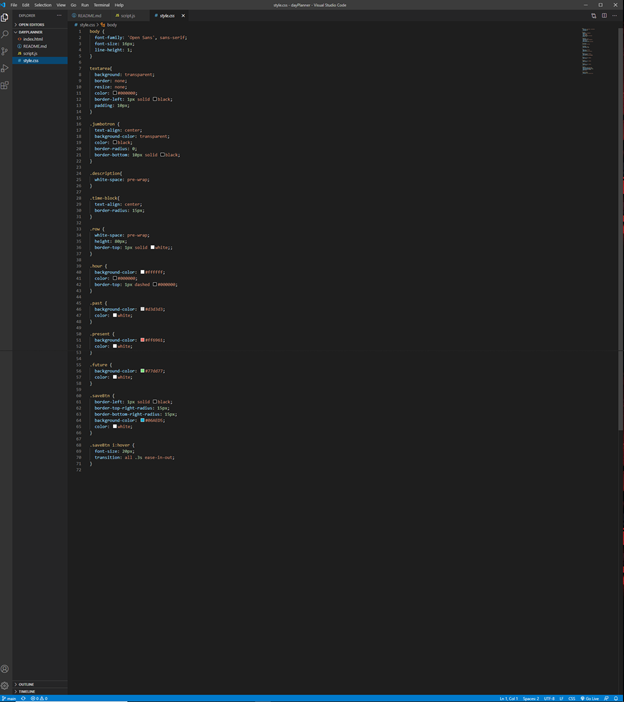

<header>
    <h1>Day Planner</h1>
</header>

<body>

<h2>Purpose:</h2>
    

 The purpose of this activity was to build an fully functional day planner. The planner had to allow the time and date to your local computer. Doing so allowed the planner to judge whether the event was past, present, or furture also providing color for visual aid. Finally the user had to be able to add events to the day planner and save them using local storage so when the page was refreshed they would still exist on their computer. 

<h2>Task List:</h2>

<ol>
    <li> Deploy a Functional Webpage </li>
    <li> Provide the user with the ability to add events to the planner </li>
    <li> On the back end provide current date/time sync from local computer to the webpage</li>
    <li> Provide the user the ability to save the events to the planner (local storage)</li>
    <li> Provide colored rows to visually aid in events that have occured and are to come</li>
    <li> Provide clean and fuctional code using jQuery</li>
</ol>

<h2>Website Deployment</h2>

 The current version of this website can be found here. <a href="https://bhamm90.github.io/dayPlanner/">(Day Planner)</a>

<h2>Feedback</h2>

 Please get ahold of me with any suggestions for features/items you believe should be added. Also feel free to let me know of any issues you may come across while using the page. You can reach me on <a href="https://stackoverflow.com/users/14324130/bhamm90">Stack Overflow</a> with any comments and concerns. For any issues and fixes you can file an issue at the <a href="https://github.com/BHamm90/dayPlanner/issues">Day Planner link </a> <-- so I can fix them as soon as possible. 

<h3>Website Preview:</h3>

<h3>Preview of the HTML: <h3>

<h3>Preview of the Javascript</h3>

<h3>Preview of the CSS</h3>

<h4>Looking Forward: </h4>

 Looking forward I would like to continue updating this day planner. I would like to see about the possiblity of extending it out into a monthly planner. Also I would like to find a way for the events to auto save as the user is typing them in so you dont have to remember to click the save button. Lastly as always any suggestions to make your user experience better are always welcome so please feel free to let me know.

<Footer>
 
 © 2020 Trilogy Education Services, a 2U, Inc. brand. All Rights Reserved. 

</Footer>